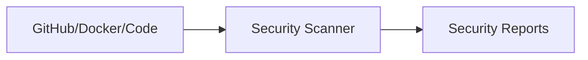

# Minimal Repository Demonstrating SBOM / SCA Scanning

* Scanning is done through a [GitHub action](./.github/workflows/scan.yml).
* You can see the action runs in the [Actions View](https://github.com/TotoBarbota/sbom-sca-scanner/actions).
* You can view Security findings under Security -> Code Scanning (note: you need to have collaborator access to see these findings).

## Architecture

Most devsecops scanners follow a similar structure:

